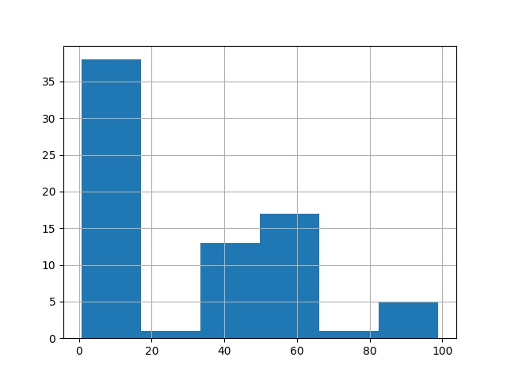
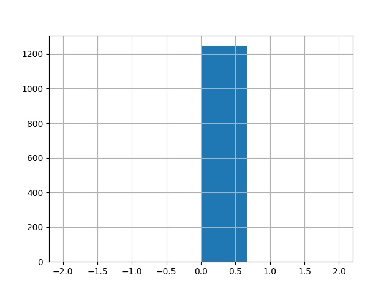

# TS-scale-interpretation
In text simplification, many rating scales are currently used. In this code, we propose a method for a sanity check of the human judgments. If a corpus contains sentence pairs, which are identical, the ratings of these pairs can be used to check the scale interpretation of the annotators, e.g., if all raters annotated the simplicity or the meaning preservation with the expected values. This analysis can show if different scale interpretations exist. The example code analyses the human judements provided for HSplit, ASSET, Human-likert, System-likert, QATS, Fusion and PWKP-test. The results are published in ["When the Scale is Unclear – Analysis of the Interpretation of Rating Scales in Human Evaluation of Text Simplification" (Stodden, 2021)](http://ceur-ws.org/Vol-2944/paper6.pdf).


## Installation
- install Python 3 (tested with 3.8)
- `pip install -r requirements`
- download data using the `main.sh` script
- run `sh example.sh` to reproduce the results of the paper
### More and own data
- data of Fusion is not publicly available, please contact the authors of [Schwarzer etal. (2021)](https://aclanthology.org/2021.textgraphs-1.10)
  - unpack the files in the data directory
  - run `python3 unbuild`

- if you want to check own data, please bring it in a csv format:
    - one aligned sentence pair per line
    - please include at least the following columns
      - **original_sentence**: original sentence: input sentence or original sentence,
      - simplified sentence: output sentence or simplified sentence,
      - **rater_id**: rater id: name or id of the current rater,
      - **sentence_id**: sentence id: id of the current original sentence
      - **sample_id**: sample id: id of the current sentence pair, relevant if the same original sentence was simplified by different systems
      - **aspect**: name of rating dimension: name of dimension of current rating, e.g., simplicity or meaning preservation. Make sure that the relevant columns are an relative rating between the original and the simplified sentence 
      - **rating**: rating score of the dimension specified in the previous column
    - you can either use the proposed column names or specify the relevant column names via command line arguments

## Data Overview
| Corpus 	| # sentence-pairs 	| # no-change-pairs 	| # annotation-records 	| # no-change-records 	| % no-change-records 	| expected value simplicity	| expected ratings in % simplicity	|
|---	|---	|---	|---	|---	|---	|---	|---	|
| **HSplit** 	| 1680 	| 70 	| 20160 	| 4992 	| 24.76 	| 0 	| 99.76 	|
| **ASSET human** 	| 100 	| 5 	| 4500 	| 225 	| 5.0 	| 0;20 	| 50.67 	|
| **Human System Likert** 	| 267 	| 5 	| 18630 	| 216 	| 1.16 	| 0;20 	| 50.0 	|
| **Human Likert** 	| 108 	| 3 	| 9357 	| 126 	| 1.35 	| 0;20 	| 50.0 	|
| **System Likert** 	| 159 	| 2 	| 9273 	| 90 	| 0.97 	| 0;20 	| 50.0 	|
| **Fusion** 	| 2920 	| 319 	| 2920 	| 338 	| 11.58 	| 0 	| 98.22 	|

- no change pairs are sentence pairs in which the original and the simplified sentence are equal. The simplicity ratings of all raters of no-change pairs should reflect that and should all be similar or even the same. 
- see references and data sources in our paper.
- PWKP should contain 100 different sentences but 1 sentence occurs twice
- In human-system-likert, the original sentences are slightly differing in their capitalization, hence they contain more different sentences than the expected 100.
- all datasets, except asset, contain ratings to sentence pairs which are simplified by different systems. Therefore, more sentence pairs than sentences exist. 

## Results
### Example of simplicity rating distribution on no-change pairs
#### ASSET
- the raters in ASSET have different interpretations of the simplicity scale, especially of the score 0
- 0 can either mean 
  - the simplified sentence _is as complex_ as the original sentence **AND** the simplifies sentence _is more complex_ than the original sentence, or
  - the simplifies sentence _is more complex_ than the original sentence. In this interpretation, 50 stands for same complexity.


#### HSplit
- the raters in HSplit have the same interpretation of the simplicity scale



### Differences in annotations of raters with different interpretation
#### ASSET
- 20 annotators rated more than one change pair  
  - 7 annotated different simplicity score for the no-change pairs
  - 13 always annotated the same simplicity score for all no-change pairs
    - 7 raters always prefered low values (close to 0)
    - 6 raters always preferd middle values (close to 50)
- the group with preference 0 have a lower average on all sentence pairs with a change than the group with preference 50
- the ratings of both groups differ significantly
- we come to the conclusion that two different scale interpretations exist in ASSET as well as in human_system_likert

## Authors

If you have any question, please contact the author:

**Regina Stodden** (Heinrich-Heine-University, Düsseldorf, Germany) ([regina.stodden@hhu.de](mailto:regina.stodden@hhu.de))

## Citation
If you use our work, please cite:

```bibtex
@inproceedings{stodden-2021-scale-unclear,
    author = {Regina Stodden},
    title = {When the Scale is Unclear – Analysis of the Interpretation of Rating Scales in Human Evaluation of Text Simplification},
    booktitle = {Proceedings of the First Workshop on Current Trends in Text Simplification (CTTS 2021)},
    year = {2021},
    location = {online},
    pages = {84-95},
    organization={CEUR-WS},
    editor = {Horacio Saggion, Sanja Štajner, Daniel Ferrés, Kim Cheng Sheang},
    url = {http://ceur-ws.org/Vol-2944/paper6.pdf},
}
```


## License

See the [LICENSE](LICENSE) file for more details.
